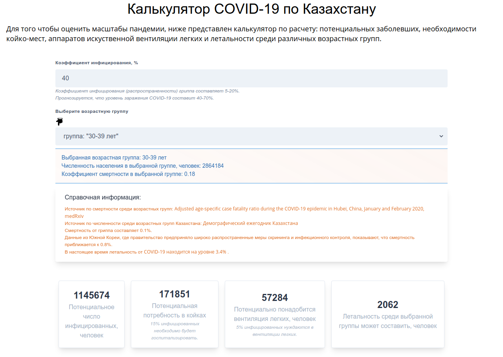

### Что такое коронавирус COVID-19?
Коронавирусная инфекция COVID-19 – это инфекционное заболевание, вызванное новым коронавирусом, который ранее у людей не обнаруживался.

Воздействие данного вируса приводит к развитию респираторного гриппоподобного заболевания с такими симптомами как кашель, лихорадка и, в более тяжелых случаях, пневмония.

### Зачем нужны ограничительные меры в виде карантина?
В эпидемиологии принцип смягчения удара по системе медицинской помощи является одним из основных действенных мер реагирования на эпидемии. Его наглядно иллюстрирует простая кривая распределения с двумя вариантами развития эпидемии любого заболевания – без сдерживающих мер и с их активным применением.

Динамика эпидемии подчиняется простым математическим законам: если в среднем один инфицированный человек заражает больше одного человека в восприимчивой популяции, то число заболевших будет расти по экспоненте. Эта экспонента может быть более крутой – если ничего не делать, или менее крутой – если вводить карантин, закрывать школы и предпринимать другие меры по «сглаживанию пика».

В случае если не принимать решительных мер, скорость распространения инфекции может быть настолько быстрой, что очень скоро число заболевших, нуждающихся в медпомощи, превышает имеющиеся ресурсы медиков, которые нельзя быстро увеличить. Начинает не хватать коек в палатах, аппаратов искусственной вентиляции лёгких, врачей и мед персонала. В итоге смертность оказывается существенно выше, чем при реализации мер по сдерживанию быстрого роста инфицированных.

Если же распространение инфекции удаётся существенно замедлить за счёт сдерживающих мер, прежде всего в виде изоляции, эпидемия при этом по-прежнему продолжает распространяться, но появление новых тяжёлых пациентов «размазывается» во времени. В результате ограниченных медицинских ресурсов оказывается вполне достаточно для оказания помощи. Дополнительный плюс такого сценария ещё и в том, что медицинский персонал, который принимает основной удар на себя, рискуя заразиться, могут работать в более спокойном режиме и не подвергаться чрезмерной опасности, тем самым оказывая максимально эффективную помощь. 

### Как примерно оценить количество зараженных и последствия?
На разработанном нами ресурсе __[covid.ecomarine.kz](https://covid.ecomarine.kz/)__ — мы реализовали простейший калькулятор для примерной оценки масштабов эпидемии в Казахстане на основе доступных публичных данных. 

Выберите возрастную группу к которой вы относитесь или все возрастные группы и укажите коэффициент инфицирования, результат расчета отобразится ниже. 

### Помогут ли меры изоляции предпринимаемые правительством Казахстана?
Один из самых ярких примеров [так называемый испанский грипп](https://www.bbc.com/russian/vert-fut-51723306) [исторический анализ](https://stacks.cdc.gov/view/cdc/44313) которой показал что:

1. отмена массовых собраний (например, в церквях и театрах) в сочетании с закрытием школ ассоциировалась с более низкими пиковыми уровнями смертности; и
2. в городах, где ранее осуществлялись многочисленные мероприятия (например, отмена массовых мероприятий в сочетании с изоляцией и карантином и закрытием школ), отмечались более значительные задержки в достижении пиковых показателей смертности, более низкие пиковые показатели смертности и более низкая общая смертность.

### Как уберечь себя и своих близких?
Следуйте рекомендациям [ВОЗ](https://www.who.int/ru/emergencies/diseases/novel-coronavirus-2019) и [Министерства здравоохранения РК](https://hls.kz) в части личной безопасности, соблюдайте меры социального дистанцирования, подробнее симптомах и мерах защиты от короновируса COVID-19 вы можете узнать на нашем ресурсе: [covid.ecomarine.kz](https://covid.ecomarine.kz/).
<!--more-->

